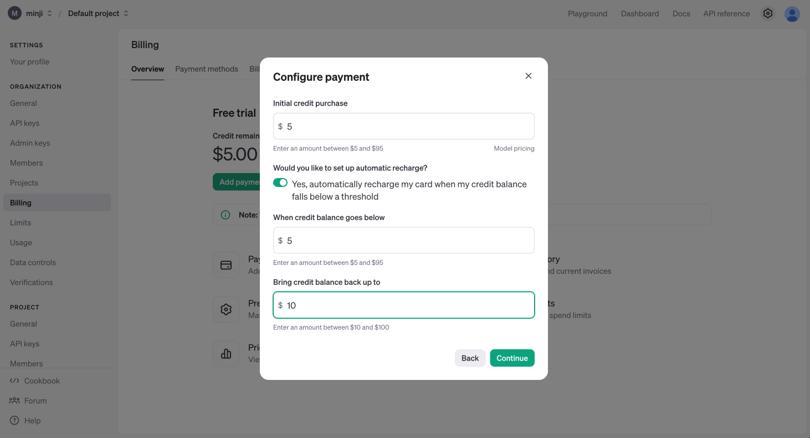

<style>
.custom {
    background-color: #008d8d;
    color: white;
    padding: 0.25em 0.5em 0.25em 0.5em;
    white-space: pre-wrap;       /* css-3 */
    white-space: -moz-pre-wrap;  /* Mozilla, since 1999 */
    white-space: -pre-wrap;      /* Opera 4-6 */
    white-space: -o-pre-wrap;    /* Opera 7 */
    word-wrap: break-word;
}

pre {
    background-color: #027c7c;
    padding-left: 0.5em;
}

</style>

# OpenAI API Key Generation and Testing Guide

- Author: [Minji](https://github.com/r14minji)
- Design: 
- Peer Review: 
- This is a part of [LangChain Open Tutorial](https://github.com/LangChain-OpenTutorial/LangChain-OpenTutorial)

[](https://colab.research.google.com/github/LangChain-OpenTutorial/LangChain-OpenTutorial/blob/main/01-Basic/03-OpenAIAPIKeyGeneration.ipynb) [](https://github.com/LangChain-OpenTutorial/LangChain-OpenTutorial/blob/main/01-Basic/03-OpenAIAPIKeyGeneration.ipynb)

## Overview

This guide explains how to get and use an OpenAI API key, including costs and limits.

To begin, you'll create your API key on OpenAI's platform and set up your development environment.

After setup, you can test your API key to ensure it works correctly with your applications.

### Table of Contents
- [Overview](#overview)
- [Setting Up OpenAI API Payment and Usage Limits](#setting-up-openai-api-payment-and-usage-limits)
- [OpenAI API Key Generation](#openai-api-key-generation)
- [Environment Setup](#environment-setup)

----

## Setting Up OpenAI API Payment and Usage Limits

Visit the OpenAI API website


- Visit: https://platform.openai.com/docs/overview

Click **"Sign Up"** in the top right corner to create an account (If you already have an account, click **"Log in")**.


After logging in, navigate to your **settings** in the top right corner and select "Billing"


In the left "Billing" menu, click on "Payment methods" to register your credit card.


Once your credit card is registered, it will appear in the list of payment methods as shown below.


Click the "Add to credit balance" button to enter the amount in USD you wish to use.


You can add funds starting from $5 (meaning you must pay at least the minimum amount of $5).

After entering the amount, click "Continue" to proceed with the payment.



In the **"Limits"** tab on the left, you can set your monthly usage limits

- **"Set a monthly budget"** : This sets your monthly spending limit. Once you reach this amount, billing stops and the API will cease to function.
- **"Set an email notification threshold"** : You can specify the amount at which you'll receive an email notification. When your usage reaches this amount, you'll get an email alert.


## OpenAI API Key Generation

Click on your profile picture in the top-right corner, then select **"Your Profile."** 


Access the API Key Management Menu

- Visit: https://platform.openai.com/api-keys


Click on **"Create new secret key"**


Enter a Name and select a project (if you haven't created any projects, select Default project)


Click the **"Copy"** button on the right to copy your key.

**IMPORTANT WARNING!!!**

If your key is leaked, others can use your API KEY to access GPT services, and charges will be billed to **YOUR account** .
**NEVER share your key** with others and store it in a secure location! (Think of it as your password)


## Environment Setup

Setting up the `.env` File

1. Create a `.env` file in your project's root directory.
2. In the `.env` file, enter `OPENAI_API_KEY=your-copied-key` then press Ctrl + S to save and close the file.


Setting up the .gitignore File
1. Create a `.gitignore` file in your project's root directory.
2. Add `.env` to your `.gitignore` file to prevent it from being tracked by Git.


```python
# Update LangChain
!pip install langchain-opentutorial
```

```python
# Configuration file to manage API KEY as environment variable
# Install: pip install python-dotenv
from dotenv import load_dotenv

# Load API KEY information
load_dotenv()
```

```python
True
```

Let's verify if the API Key is properly configured:

```python
import os
print(f"[API KEY]\n{os.environ['OPENAI_API_KEY']}")
```
