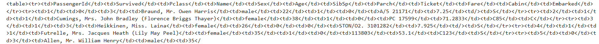

<style>
.custom {
    background-color: #008d8d;
    color: white;
    padding: 0.25em 0.5em 0.25em 0.5em;
    white-space: pre-wrap;       /* css-3 */
    white-space: -moz-pre-wrap;  /* Mozilla, since 1999 */
    white-space: -pre-wrap;      /* Opera 4-6 */
    white-space: -o-pre-wrap;    /* Opera 7 */
    word-wrap: break-word;
}

pre {
    background-color: #027c7c;
    padding-left: 0.5em;
}

</style>

# Excel File Loading in LangChain

- Author: [Hwayoung Cha](https://github.com/forwardyoung)
- Design: []()
- Peer Review :
- This is a part of [LangChain Open Tutorial](https://github.com/LangChain-OpenTutorial/LangChain-OpenTutorial)

[](https://colab.research.google.com/github/LangChain-OpenTutorial/LangChain-OpenTutorial/blob/main/06-DocumentLoader/05-Excel-Loader.ipynb) [](https://github.com/LangChain-OpenTutorial/LangChain-OpenTutorial/blob/main/06-DocumentLoader/05-Excel-Loader.ipynb)

## Overview

This tutorial covers the process of loading and handling `Microsoft Excel` files in `LangChain` .

It focuses on two primary methods: `UnstructuredExcelLoader` for raw text extraction and `DataFrameLoader` for structured data processing.

The guide aims to help developers effectively integrate Excel data into their `LangChain` projects, covering both basic and advanced usage scenarios.

### Table of Contents

- [Overview](#overview)
- [Environment Setup](#environment-setup)
- [UnstructuredExcelLoader](#UnstructuredExcelLoader)
- [DataFrameLoader](#DataFrameLoader)
----

## Environment Setup

Set up the environment. You may refer to [Environment Setup](https://wikidocs.net/257836) for more details.

**[Note]**
- `langchain-opentutorial` is a package that provides a set of easy-to-use environment setup, useful functions and utilities for tutorials. 
- You can checkout the [`langchain-opentutorial`](https://github.com/LangChain-OpenTutorial/langchain-opentutorial-pypi) for more details.

```python
%%capture --no-stderr
%pip install langchain-opentutorial
```

```python
# Install required packages
from langchain_opentutorial import package

package.install(
    [
        "langchain_community",
        "unstructured",
        "openpyxl"
    ],
    verbose=False,
    upgrade=False,
)
```

## UnstructuredExcelLoader

`UnstructuredExcelLoader` is used to load `Microsoft Excel` files.

This loader works with both `.xlsx` and `.xls` files.

When the loader is used in `"elements"` mode, an HTML representation of the Excel file is provided under the `text_as_html` key in the document metadata.

```python
# install
# %pip install -qU langchain-community unstructured openpyxl
```

```python
import sys
from langchain_community.document_loaders import UnstructuredExcelLoader

# Set recursion limit
sys.setrecursionlimit(10**6)    

# Create UnstructuredExcelLoader 
loader = UnstructuredExcelLoader("./data/titanic.xlsx", mode="elements")

# Load a document
docs = loader.load()

# Print the number of documents
print(len(docs))
```

This confirms that one document has been loaded.

The `page_content` contains the data from each row, while the `text_as_html` in the `metadata` stores the data in HTML format.

```python
# Print the document
print(docs[0].page_content[:200])
```

```python
# Print the text_as_html of metadata
print(docs[0].metadata["text_as_html"][:1000])
```



## DataFrameLoader

- Similar to CSV files, we can load Excel files by using the `read_excel()` function to create a DataFrame, and then load it.

```python
import pandas as pd

# read the Excel file
df = pd.read_excel("./data/titanic.xlsx")
```

```python
from langchain_community.document_loaders import DataFrameLoader

# Set up DataFrame loader, specifying the page content column
loader = DataFrameLoader(df, page_content_column="Name")

# Load the document
docs = loader.load()

# Print the data
print(docs[0].page_content)

# Print the metadata
print(docs[0].metadata)
```
