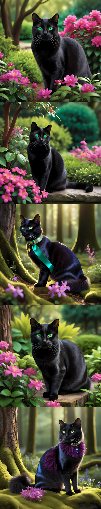

<style>
.custom {
    background-color: #008d8d;
    color: white;
    padding: 0.25em 0.5em 0.25em 0.5em;
    white-space: pre-wrap;       /* css-3 */
    white-space: -moz-pre-wrap;  /* Mozilla, since 1999 */
    white-space: -pre-wrap;      /* Opera 4-6 */
    white-space: -o-pre-wrap;    /* Opera 7 */
    word-wrap: break-word;
}

pre {
    background-color: #027c7c;
    padding-left: 0.5em;
}

</style>

# Multimodal Embeddings With Langchain

- Author: [Gwangwon Jung](https://github.com/pupba)
- Design: []()
- Peer Review : [Teddy Lee](https://github.com/teddylee777), [DoWoung Kong](https://github.com/krkrong)
- This is a part of [LangChain Open Tutorial](https://github.com/LangChain-OpenTutorial/LangChain-OpenTutorial)

[](https://colab.research.google.com/github/LangChain-OpenTutorial/LangChain-OpenTutorial/blob/main/08-Embeeding/08-MultiModalEmbeddings.ipynb) [](https://github.com/LangChain-OpenTutorial/LangChain-OpenTutorial/blob/main/08-Embeeding/08-MultiModalEmbeddings.ipynb)

## Overview

This tutorial covers how to perform `Text Embedding` and `Image Embedding` using `Multimodal Embedding Model` with `Langchain`.

The `Multimodal Embedding Model` is a model that can vectorize **text** as well as **image**.

In this tutorial, we will create a simple **Image Similarity Searching** example using `Multimodal Embedding Model` and `Langchain`.


### Table of Contents

- [Overview](#overview)
- [Environement Setup](#environment-setup)
- [Multimodal Embedding](#multimodal-embedding)
- [What is Image Similarity Search?](#what-is-image-similarity-search?)
- [Setting Image Data](#setting-image-data)
- [Model Load and Embedding Images](#model-load-and-embedding-images)
- [Image Similarity Search with Text](#image-similarity-search-with-text)
- [Image Similarity Search with Image](#image-similarity-search-with-image)

### References

- [Multimodal Embedding](https://learn.microsoft.com/en-us/azure/ai-services/computer-vision/concept-image-retrieval)
- [Similarity Search](https://en.wikipedia.org/wiki/Similarity_search)
- [OpenCLIP](https://github.com/mlfoundations/open_clip)
----

## Environment Setup

Set up the environment. You may refer to [Environment Setup](https://wikidocs.net/257836) for more details.

**[Note]**
- `langchain-opentutorial` is a package that provides a set of easy-to-use environment setup, useful functions and utilities for tutorials. 
- You can checkout the [`langchain-opentutorial`](https://github.com/LangChain-OpenTutorial/langchain-opentutorial-pypi) for more details.

```python
%%capture --no-stderr
%pip install langchain-opentutorial
```

```python
# Install required packages
from langchain_opentutorial import package

package.install(
    [
        "langchain-experimental",
        "pillow",
        "open_clip_torch",
        "scikit-learn",
        "numpy",
        "requests",
    ],
    verbose=False,
    upgrade=False,
)
```

## Multimodal Embedding

Multimodal embedding is the process of creating a vector that represents an image’s features and context, making it compatible with text search in the same vector space.


## What is Image Similarity Search?

**Image Similarity Search** is a technique that allows you to find images in a database that are similar to a given query (either an image or text describing the image) using vector-based representations. 

The process involves converting images or text into embedding vectors that capture their visual or semantic features.

These vectors are then compared using similarity metrics, such as `Cosine Similarity` or `Euclidean Distance`, to find the most similar images in the database based on their vector representations.

## Setting Image Data

In this tutorial, example images are provided. These images are copyright-free and cover a variety of topics (e.g., dog, cat, female, male,...) created using `SDXL`.

The images are located at `./data/for_embed_images.zip`.

Create a list containing the image path.

```python
# Unzip to image dataset
import zipfile
import tempfile
import os


def extract_zip_to_tempdir(zip_file_path: str) -> str:
    """
    Extract a ZIP file containing .png images to a temporary directory.

    Args:
        zip_file_path (str): Path to the ZIP file.

    Returns:
        str: Path to the temporary directory containing the extracted files.
    """
    # Create a temporary directory
    temp_dir = tempfile.mkdtemp()

    # Extract ZIP file contents to the temporary directory
    with zipfile.ZipFile(zip_file_path, "r") as zip_ref:
        zip_ref.extractall(temp_dir)

    return temp_dir
```

```python
from PIL import Image

# in colab : "os.getcwd()" replace to "<your-drive-path>"

DATA_ROOT_DIR = os.path.join(
    os.getcwd(), "08-EMBEDDING", "data", "for_embed_images.zip"
)

image_temp_dir = extract_zip_to_tempdir(DATA_ROOT_DIR)

image_path_db = [
    os.path.join(image_temp_dir, img_n)
    for img_n in os.listdir(image_temp_dir)
    if img_n.endswith(".png")
]
```

## Model Load and Embedding Images

In this tutorial, we use `OpenCLIP`, which implements OpenAI's `CLIP` as an open source.

- [OpenCLIP Github](https://github.com/mlfoundations/open_clip)

`OpenCLIP` can be used with `Langchain` to easily embed **Text** and **Image** .

You can load `OpenCLIP Embedding` model using the `Python` libraries `open_clip_torch` and `langchain-experimental`.

```python
# List of (Model,Checkpoint)
import open_clip

open_clip.list_pretrained()
```


<pre class="custom">[('RN50', 'openai'),
     ('RN50', 'yfcc15m'),
     ('RN50', 'cc12m'),
     ('RN101', 'openai'),
     ('RN101', 'yfcc15m'),
     ('RN50x4', 'openai'),
     ('RN50x16', 'openai'),
     ('RN50x64', 'openai'),
     ('ViT-B-32', 'openai'),
     ('ViT-B-32', 'laion400m_e31'),
     ('ViT-B-32', 'laion400m_e32'),
     ('ViT-B-32', 'laion2b_e16'),
     ('ViT-B-32', 'laion2b_s34b_b79k'),
     ('ViT-B-32', 'datacomp_xl_s13b_b90k'),
     ('ViT-B-32', 'datacomp_m_s128m_b4k'),
     ('ViT-B-32', 'commonpool_m_clip_s128m_b4k'),
     ('ViT-B-32', 'commonpool_m_laion_s128m_b4k'),
     ('ViT-B-32', 'commonpool_m_image_s128m_b4k'),
     ('ViT-B-32', 'commonpool_m_text_s128m_b4k'),
     ('ViT-B-32', 'commonpool_m_basic_s128m_b4k'),
     ('ViT-B-32', 'commonpool_m_s128m_b4k'),
     ('ViT-B-32', 'datacomp_s_s13m_b4k'),
     ('ViT-B-32', 'commonpool_s_clip_s13m_b4k'),
     ('ViT-B-32', 'commonpool_s_laion_s13m_b4k'),
     ('ViT-B-32', 'commonpool_s_image_s13m_b4k'),
     ('ViT-B-32', 'commonpool_s_text_s13m_b4k'),
     ('ViT-B-32', 'commonpool_s_basic_s13m_b4k'),
     ('ViT-B-32', 'commonpool_s_s13m_b4k'),
     ('ViT-B-32', 'metaclip_400m'),
     ('ViT-B-32', 'metaclip_fullcc'),
     ('ViT-B-32-256', 'datacomp_s34b_b86k'),
     ('ViT-B-16', 'openai'),
     ('ViT-B-16', 'laion400m_e31'),
     ('ViT-B-16', 'laion400m_e32'),
     ('ViT-B-16', 'laion2b_s34b_b88k'),
     ('ViT-B-16', 'datacomp_xl_s13b_b90k'),
     ('ViT-B-16', 'datacomp_l_s1b_b8k'),
     ('ViT-B-16', 'commonpool_l_clip_s1b_b8k'),
     ('ViT-B-16', 'commonpool_l_laion_s1b_b8k'),
     ('ViT-B-16', 'commonpool_l_image_s1b_b8k'),
     ('ViT-B-16', 'commonpool_l_text_s1b_b8k'),
     ('ViT-B-16', 'commonpool_l_basic_s1b_b8k'),
     ('ViT-B-16', 'commonpool_l_s1b_b8k'),
     ('ViT-B-16', 'dfn2b'),
     ('ViT-B-16', 'metaclip_400m'),
     ('ViT-B-16', 'metaclip_fullcc'),
     ('ViT-B-16-plus-240', 'laion400m_e31'),
     ('ViT-B-16-plus-240', 'laion400m_e32'),
     ('ViT-L-14', 'openai'),
     ('ViT-L-14', 'laion400m_e31'),
     ('ViT-L-14', 'laion400m_e32'),
     ('ViT-L-14', 'laion2b_s32b_b82k'),
     ('ViT-L-14', 'datacomp_xl_s13b_b90k'),
     ('ViT-L-14', 'commonpool_xl_clip_s13b_b90k'),
     ('ViT-L-14', 'commonpool_xl_laion_s13b_b90k'),
     ('ViT-L-14', 'commonpool_xl_s13b_b90k'),
     ('ViT-L-14', 'metaclip_400m'),
     ('ViT-L-14', 'metaclip_fullcc'),
     ('ViT-L-14', 'dfn2b'),
     ('ViT-L-14-336', 'openai'),
     ('ViT-H-14', 'laion2b_s32b_b79k'),
     ('ViT-H-14', 'metaclip_fullcc'),
     ('ViT-H-14', 'dfn5b'),
     ('ViT-H-14-378', 'dfn5b'),
     ('ViT-g-14', 'laion2b_s12b_b42k'),
     ('ViT-g-14', 'laion2b_s34b_b88k'),
     ('ViT-bigG-14', 'laion2b_s39b_b160k'),
     ('ViT-bigG-14', 'metaclip_fullcc'),
     ('roberta-ViT-B-32', 'laion2b_s12b_b32k'),
     ('xlm-roberta-base-ViT-B-32', 'laion5b_s13b_b90k'),
     ('xlm-roberta-large-ViT-H-14', 'frozen_laion5b_s13b_b90k'),
     ('convnext_base', 'laion400m_s13b_b51k'),
     ('convnext_base_w', 'laion2b_s13b_b82k'),
     ('convnext_base_w', 'laion2b_s13b_b82k_augreg'),
     ('convnext_base_w', 'laion_aesthetic_s13b_b82k'),
     ('convnext_base_w_320', 'laion_aesthetic_s13b_b82k'),
     ('convnext_base_w_320', 'laion_aesthetic_s13b_b82k_augreg'),
     ('convnext_large_d', 'laion2b_s26b_b102k_augreg'),
     ('convnext_large_d_320', 'laion2b_s29b_b131k_ft'),
     ('convnext_large_d_320', 'laion2b_s29b_b131k_ft_soup'),
     ('convnext_xxlarge', 'laion2b_s34b_b82k_augreg'),
     ('convnext_xxlarge', 'laion2b_s34b_b82k_augreg_rewind'),
     ('convnext_xxlarge', 'laion2b_s34b_b82k_augreg_soup'),
     ('coca_ViT-B-32', 'laion2b_s13b_b90k'),
     ('coca_ViT-B-32', 'mscoco_finetuned_laion2b_s13b_b90k'),
     ('coca_ViT-L-14', 'laion2b_s13b_b90k'),
     ('coca_ViT-L-14', 'mscoco_finetuned_laion2b_s13b_b90k'),
     ('EVA01-g-14', 'laion400m_s11b_b41k'),
     ('EVA01-g-14-plus', 'merged2b_s11b_b114k'),
     ('EVA02-B-16', 'merged2b_s8b_b131k'),
     ('EVA02-L-14', 'merged2b_s4b_b131k'),
     ('EVA02-L-14-336', 'merged2b_s6b_b61k'),
     ('EVA02-E-14', 'laion2b_s4b_b115k'),
     ('EVA02-E-14-plus', 'laion2b_s9b_b144k'),
     ('ViT-B-16-SigLIP', 'webli'),
     ('ViT-B-16-SigLIP-256', 'webli'),
     ('ViT-B-16-SigLIP-i18n-256', 'webli'),
     ('ViT-B-16-SigLIP-384', 'webli'),
     ('ViT-B-16-SigLIP-512', 'webli'),
     ('ViT-L-16-SigLIP-256', 'webli'),
     ('ViT-L-16-SigLIP-384', 'webli'),
     ('ViT-SO400M-14-SigLIP', 'webli'),
     ('ViT-SO400M-16-SigLIP-i18n-256', 'webli'),
     ('ViT-SO400M-14-SigLIP-378', 'webli'),
     ('ViT-SO400M-14-SigLIP-384', 'webli'),
     ('ViT-L-14-CLIPA', 'datacomp1b'),
     ('ViT-L-14-CLIPA-336', 'datacomp1b'),
     ('ViT-H-14-CLIPA', 'datacomp1b'),
     ('ViT-H-14-CLIPA-336', 'laion2b'),
     ('ViT-H-14-CLIPA-336', 'datacomp1b'),
     ('ViT-bigG-14-CLIPA', 'datacomp1b'),
     ('ViT-bigG-14-CLIPA-336', 'datacomp1b'),
     ('nllb-clip-base', 'v1'),
     ('nllb-clip-large', 'v1'),
     ('nllb-clip-base-siglip', 'v1'),
     ('nllb-clip-base-siglip', 'mrl'),
     ('nllb-clip-large-siglip', 'v1'),
     ('nllb-clip-large-siglip', 'mrl'),
     ('MobileCLIP-S1', 'datacompdr'),
     ('MobileCLIP-S2', 'datacompdr'),
     ('MobileCLIP-B', 'datacompdr'),
     ('MobileCLIP-B', 'datacompdr_lt'),
     ('ViTamin-S', 'datacomp1b'),
     ('ViTamin-S-LTT', 'datacomp1b'),
     ('ViTamin-B', 'datacomp1b'),
     ('ViTamin-B-LTT', 'datacomp1b'),
     ('ViTamin-L', 'datacomp1b'),
     ('ViTamin-L-256', 'datacomp1b'),
     ('ViTamin-L-336', 'datacomp1b'),
     ('ViTamin-L-384', 'datacomp1b'),
     ('ViTamin-L2', 'datacomp1b'),
     ('ViTamin-L2-256', 'datacomp1b'),
     ('ViTamin-L2-336', 'datacomp1b'),
     ('ViTamin-L2-384', 'datacomp1b'),
     ('ViTamin-XL-256', 'datacomp1b'),
     ('ViTamin-XL-336', 'datacomp1b'),
     ('ViTamin-XL-384', 'datacomp1b'),
     ('RN50-quickgelu', 'openai'),
     ('RN50-quickgelu', 'yfcc15m'),
     ('RN50-quickgelu', 'cc12m'),
     ('RN101-quickgelu', 'openai'),
     ('RN101-quickgelu', 'yfcc15m'),
     ('RN50x4-quickgelu', 'openai'),
     ('RN50x16-quickgelu', 'openai'),
     ('RN50x64-quickgelu', 'openai'),
     ('ViT-B-32-quickgelu', 'openai'),
     ('ViT-B-32-quickgelu', 'laion400m_e31'),
     ('ViT-B-32-quickgelu', 'laion400m_e32'),
     ('ViT-B-32-quickgelu', 'metaclip_400m'),
     ('ViT-B-32-quickgelu', 'metaclip_fullcc'),
     ('ViT-B-16-quickgelu', 'openai'),
     ('ViT-B-16-quickgelu', 'dfn2b'),
     ('ViT-B-16-quickgelu', 'metaclip_400m'),
     ('ViT-B-16-quickgelu', 'metaclip_fullcc'),
     ('ViT-L-14-quickgelu', 'openai'),
     ('ViT-L-14-quickgelu', 'metaclip_400m'),
     ('ViT-L-14-quickgelu', 'metaclip_fullcc'),
     ('ViT-L-14-quickgelu', 'dfn2b'),
     ('ViT-L-14-336-quickgelu', 'openai'),
     ('ViT-H-14-quickgelu', 'metaclip_fullcc'),
     ('ViT-H-14-quickgelu', 'dfn5b'),
     ('ViT-H-14-378-quickgelu', 'dfn5b'),
     ('ViT-bigG-14-quickgelu', 'metaclip_fullcc')]</pre>


```python
# model and checkpoint setting

MODEL = "ViT-g-14"
CHECKPOINT = "laion2b_s34b_b88k"
```

```python
# model load
from langchain_experimental.open_clip import OpenCLIPEmbeddings

clip_embedding = OpenCLIPEmbeddings(
    model_name=MODEL,
    checkpoint=CHECKPOINT,
)

# Show Model Architecture
clip_embedding
```


<pre class="custom">OpenCLIPEmbeddings(model=CLIP(
      (visual): VisionTransformer(
        (conv1): Conv2d(3, 1408, kernel_size=(14, 14), stride=(14, 14), bias=False)
        (patch_dropout): Identity()
        (ln_pre): LayerNorm((1408,), eps=1e-05, elementwise_affine=True)
        (transformer): Transformer(
          (resblocks): ModuleList(
            (0-39): 40 x ResidualAttentionBlock(
              (ln_1): LayerNorm((1408,), eps=1e-05, elementwise_affine=True)
              (attn): MultiheadAttention(
                (out_proj): NonDynamicallyQuantizableLinear(in_features=1408, out_features=1408, bias=True)
              )
              (ls_1): Identity()
              (ln_2): LayerNorm((1408,), eps=1e-05, elementwise_affine=True)
              (mlp): Sequential(
                (c_fc): Linear(in_features=1408, out_features=6144, bias=True)
                (gelu): GELU(approximate='none')
                (c_proj): Linear(in_features=6144, out_features=1408, bias=True)
              )
              (ls_2): Identity()
            )
          )
        )
        (ln_post): LayerNorm((1408,), eps=1e-05, elementwise_affine=True)
      )
      (transformer): Transformer(
        (resblocks): ModuleList(
          (0-23): 24 x ResidualAttentionBlock(
            (ln_1): LayerNorm((1024,), eps=1e-05, elementwise_affine=True)
            (attn): MultiheadAttention(
              (out_proj): NonDynamicallyQuantizableLinear(in_features=1024, out_features=1024, bias=True)
            )
            (ls_1): Identity()
            (ln_2): LayerNorm((1024,), eps=1e-05, elementwise_affine=True)
            (mlp): Sequential(
              (c_fc): Linear(in_features=1024, out_features=4096, bias=True)
              (gelu): GELU(approximate='none')
              (c_proj): Linear(in_features=4096, out_features=1024, bias=True)
            )
            (ls_2): Identity()
          )
        )
      )
      (token_embedding): Embedding(49408, 1024)
      (ln_final): LayerNorm((1024,), eps=1e-05, elementwise_affine=True)
    ), preprocess=Compose(
        Resize(size=224, interpolation=bicubic, max_size=None, antialias=True)
        CenterCrop(size=(224, 224))
        <function _convert_to_rgb at 0x000002708C89C5E0>
        ToTensor()
        Normalize(mean=(0.48145466, 0.4578275, 0.40821073), std=(0.26862954, 0.26130258, 0.27577711))
    ), tokenizer=<open_clip.tokenizer.SimpleTokenizer object at 0x000002708ED23550>, model_name='ViT-g-14', checkpoint='laion2b_s34b_b88k')</pre>


```python
# Embedding Images
# It takes a very long time on Colab. I recommend using a smaller model instead.
image_vector_db = clip_embedding.embed_image(image_path_db)
```

```python
# Preprocessing for Image Similarity Search
from sklearn.metrics.pairwise import cosine_similarity
from sklearn.preprocessing import normalize
import numpy as np


def combine_images_vertically(images: list) -> Image.Image:
    """
    Combine the given image path list vertically and save it as a single image.

    Args:
        images (list): PIL Image List to combine.

    Returns:
        combined_image (Image.Image): A single image with all input images combined vertically.
    """

    # Extract dimensions of each image
    widths, heights = zip(*(img.size for img in images))

    # Calculate the dimensions of the combined image
    max_width = max(widths)
    total_height = sum(heights)

    # Create a blank canvas with the calculated dimensions
    combined_image = Image.new("RGB", (max_width, total_height))

    # Paste each image onto the canvas one below the other
    y_offset = 0
    for img in images:
        combined_image.paste(img, (0, y_offset))
        y_offset += img.height

    return combined_image
```

## Image Similarity Search with Text

`Image Similarity Search with Text` finds the image in the image dataset that most relates to a given `text query`.

We will use **cosine similarity** for calculation of similarity.

Because **cosine similarity** is commonly used in image similarity search.

### Steps

1. Text Query Embedding

2. Calculate the similarity between the `Text Query Embedding Vector` and the `Image Embedding Vector`

3. Get similar images

```python
"""
OpenCLIP Embedding must explain the image in detail 
to produce meaningful results of similarity in the future.
"""

text_query = "a cat with green eyes,pink flowers,tree"
```

```python
# Text Query Embedding
text_query_embedding_vector = clip_embedding.embed_query(text_query)
```

```python
# Get Similarity
similarity = cosine_similarity(
    normalize(np.array(text_query_embedding_vector).reshape(1, -1)),
    normalize(np.array(image_vector_db)),
)

sorted_idx = similarity.argsort()[0][::-1]
```

```python
for i, idx in enumerate(sorted_idx):
    # window : \\
    # mac, linux : /
    file_name = image_path_db[idx].split("\\")[-1]  # default window
    print(f"Similarity Rank{i+1} : {similarity[0][idx]:.3f} | {file_name}")
```

<pre class="custom">Similarity Rank1 : 0.297 | cat_00005_.png
    Similarity Rank2 : 0.287 | cat_00007_.png
    Similarity Rank3 : 0.283 | cat_00014_.png
    Similarity Rank4 : 0.279 | cat_00006_.png
    Similarity Rank5 : 0.272 | cat_00016_.png
    Similarity Rank6 : 0.265 | cat_00008_.png
    Similarity Rank7 : 0.260 | cat_00015_.png
    Similarity Rank8 : 0.255 | cat_00013_.png
    Similarity Rank9 : 0.186 | dog_00006_.png
    Similarity Rank10 : 0.167 | cat_00002_.png
    Similarity Rank11 : 0.164 | dog_00008_.png
    Similarity Rank12 : 0.152 | cat_00003_.png
    Similarity Rank13 : 0.150 | tree_00002_.png
    Similarity Rank14 : 0.149 | cat_00004_.png
    Similarity Rank15 : 0.146 | cat_00001_.png
    Similarity Rank16 : 0.145 | dog_00009_.png
    Similarity Rank17 : 0.141 | cat_00010_.png
    Similarity Rank18 : 0.140 | tree_00004_.png
    Similarity Rank19 : 0.140 | tree_00003_.png
    Similarity Rank20 : 0.136 | dog_00011_.png
    Similarity Rank21 : 0.133 | dog_00010_.png
    Similarity Rank22 : 0.127 | dog_00002_.png
    Similarity Rank23 : 0.126 | dog_00007_.png
    Similarity Rank24 : 0.116 | cat_00012_.png
    Similarity Rank25 : 0.116 | tree_00008_.png
    Similarity Rank26 : 0.115 | tree_00011_.png
    Similarity Rank27 : 0.114 | dog_00005_.png
    Similarity Rank28 : 0.110 | dog_00012_.png
    Similarity Rank29 : 0.108 | cat_00009_.png
    Similarity Rank30 : 0.108 | dog_00001_.png
    Similarity Rank31 : 0.107 | cat_00011_.png
    Similarity Rank32 : 0.107 | tree_00001_.png
    Similarity Rank33 : 0.100 | dog_00004_.png
    Similarity Rank34 : 0.097 | tree_00013_.png
    Similarity Rank35 : 0.096 | dog_00013_.png
    Similarity Rank36 : 0.094 | tree_00006_.png
    Similarity Rank37 : 0.093 | tree_00007_.png
    Similarity Rank38 : 0.092 | dog_00016_.png
    Similarity Rank39 : 0.092 | dog_00014_.png
    Similarity Rank40 : 0.091 | tree_00015_.png
    Similarity Rank41 : 0.089 | female_00014_.png
    Similarity Rank42 : 0.082 | dog_00003_.png
    Similarity Rank43 : 0.080 | tree_00005_.png
    Similarity Rank44 : 0.078 | dog_00015_.png
    Similarity Rank45 : 0.073 | male_00005_.png
    Similarity Rank46 : 0.071 | tree_00010_.png
    Similarity Rank47 : 0.062 | female_00012_.png
    Similarity Rank48 : 0.060 | female_00015_.png
    Similarity Rank49 : 0.060 | female_00016_.png
    Similarity Rank50 : 0.054 | cow_00006_.png
    Similarity Rank51 : 0.051 | tree_00014_.png
    Similarity Rank52 : 0.048 | tree_00012_.png
    Similarity Rank53 : 0.047 | female_00013_.png
    Similarity Rank54 : 0.046 | male_00016_.png
    Similarity Rank55 : 0.044 | tree_00016_.png
    Similarity Rank56 : 0.037 | cow_00008_.png
    Similarity Rank57 : 0.037 | cow_00004_.png
    Similarity Rank58 : 0.037 | male_00007_.png
    Similarity Rank59 : 0.036 | male_00008_.png
    Similarity Rank60 : 0.035 | cow_00007_.png
    Similarity Rank61 : 0.034 | female_00002_.png
    Similarity Rank62 : 0.034 | female_00003_.png
    Similarity Rank63 : 0.032 | tree_00009_.png
    Similarity Rank64 : 0.031 | cow_00002_.png
    Similarity Rank65 : 0.026 | cow_00003_.png
    Similarity Rank66 : 0.024 | female_00010_.png
    Similarity Rank67 : 0.023 | cow_00001_.png
    Similarity Rank68 : 0.022 | cow_00005_.png
    Similarity Rank69 : 0.011 | female_00004_.png
    Similarity Rank70 : 0.011 | female_00001_.png
    Similarity Rank71 : 0.011 | cow_00012_.png
    Similarity Rank72 : 0.009 | male_00006_.png
    Similarity Rank73 : 0.007 | female_00009_.png
    Similarity Rank74 : 0.006 | cow_00015_.png
    Similarity Rank75 : 0.006 | cow_00016_.png
    Similarity Rank76 : 0.005 | female_00011_.png
    Similarity Rank77 : 0.003 | cow_00009_.png
    Similarity Rank78 : -0.002 | cow_00014_.png
    Similarity Rank79 : -0.004 | car_00012_.png
    Similarity Rank80 : -0.005 | cow_00011_.png
    Similarity Rank81 : -0.006 | car_00011_.png
    Similarity Rank82 : -0.009 | cow_00013_.png
    Similarity Rank83 : -0.011 | male_00009_.png
    Similarity Rank84 : -0.011 | male_00004_.png
    Similarity Rank85 : -0.014 | cow_00010_.png
    Similarity Rank86 : -0.017 | female_00006_.png
    Similarity Rank87 : -0.018 | car_00009_.png
    Similarity Rank88 : -0.022 | car_00015_.png
    Similarity Rank89 : -0.023 | car_00013_.png
    Similarity Rank90 : -0.024 | car_00010_.png
    Similarity Rank91 : -0.027 | male_00010_.png
    Similarity Rank92 : -0.031 | male_00003_.png
    Similarity Rank93 : -0.032 | car_00008_.png
    Similarity Rank94 : -0.035 | car_00007_.png
    Similarity Rank95 : -0.035 | car_00005_.png
    Similarity Rank96 : -0.038 | car_00016_.png
    Similarity Rank97 : -0.038 | male_00002_.png
    Similarity Rank98 : -0.039 | male_00015_.png
    Similarity Rank99 : -0.044 | female_00008_.png
    Similarity Rank100 : -0.045 | car_00004_.png
    Similarity Rank101 : -0.048 | car_00002_.png
    Similarity Rank102 : -0.049 | female_00005_.png
    Similarity Rank103 : -0.056 | car_00014_.png
    Similarity Rank104 : -0.059 | car_00001_.png
    Similarity Rank105 : -0.061 | car_00006_.png
    Similarity Rank106 : -0.064 | female_00007_.png
    Similarity Rank107 : -0.065 | male_00012_.png
    Similarity Rank108 : -0.075 | car_00003_.png
    Similarity Rank109 : -0.084 | male_00001_.png
    Similarity Rank110 : -0.086 | male_00011_.png
    Similarity Rank111 : -0.109 | male_00013_.png
</pre>

```python
# Display the top 5 similar images
top5 = sorted_idx[:5]

comb_imgs = combine_images_vertically([Image.open(image_path_db[idx]) for idx in top5])
comb_imgs
```


    

    


## Image Similarity Search with Image

`Image Similarity Search with Image` finds the image in the image dataset that most relates to a given `image query`.

We will use **cosine similarity** for calculation of similarity.

Because **cosine Similarity** is commonly used in image similarity search.

### Steps

1. Image Query Embedding

2. Calculate the similarity between the `Image Query Embedding Vector` and the `Image Embedding Vector`

3. Get similar images

```python
# query image url
import requests
from io import BytesIO


def load_image_from_url(url: str, resolution: int = 512) -> Image.Image:
    """
    Load an image from a URL and return it as a PIL Image object.

    Args:
        url (str): The URL of the image.

    Returns:
        Image.Image: The loaded PIL Image object.
    """
    response = requests.get(url)
    response.raise_for_status()  # Raise an error for failed requests
    image = Image.open(BytesIO(response.content))
    image = image.resize((resolution, resolution), resample=Image.Resampling.LANCZOS)
    return image
```

```python
img_url = "https://i.pinimg.com/736x/85/0a/ca/850aca7cd77c110e99ab20862aef14cf.jpg"

image_query = load_image_from_url(img_url)
image_query
```


    

    


```python
def save_image_to_tempfile(url: str) -> str:
    """
    Download an image from a URL and save it to a temporary file.

    Args:
        url (str): The URL of the image.

    Returns:
        str: The file path to the saved image.
    """
    response = requests.get(url)

    # Raise an error for failed requests
    response.raise_for_status()

    # Create a temporary file
    temp_file = tempfile.NamedTemporaryFile(delete=False, suffix=".jpg")
    temp_file.write(response.content)

    # Close the file to allow other processes to access it
    temp_file.close()
    return temp_file.name
```

```python
# Image Embedding
# Save Temp file used image url
image_query_url = save_image_to_tempfile(img_url)

# Image Embedding
image_query_vector = clip_embedding.embed_image([image_query_url])

# Remove Temp file
os.remove(image_query_url)
```

```python
similarity = cosine_similarity(
    normalize(np.array(image_query_vector)),
    normalize(np.array(image_vector_db)),
)

sorted_idx = similarity.argsort()[0][::-1]
```

```python
for i, idx in enumerate(sorted_idx):
    # window : \\
    # mac, linux : /
    file_name = image_path_db[idx].split("\\")[-1]  # default window
    print(f"Similarity Rank{i+1} : {similarity[0][idx]:.3f} | {file_name}")
```

<pre class="custom">Similarity Rank1 : 0.442 | car_00009_.png
    Similarity Rank2 : 0.434 | car_00010_.png
    Similarity Rank3 : 0.428 | car_00011_.png
    Similarity Rank4 : 0.414 | car_00012_.png
    Similarity Rank5 : 0.401 | car_00013_.png
    Similarity Rank6 : 0.394 | car_00001_.png
    Similarity Rank7 : 0.385 | car_00015_.png
    Similarity Rank8 : 0.380 | car_00002_.png
    Similarity Rank9 : 0.371 | car_00016_.png
    Similarity Rank10 : 0.370 | car_00006_.png
    Similarity Rank11 : 0.365 | car_00014_.png
    Similarity Rank12 : 0.357 | car_00003_.png
    Similarity Rank13 : 0.353 | car_00005_.png
    Similarity Rank14 : 0.337 | car_00004_.png
    Similarity Rank15 : 0.335 | car_00008_.png
    Similarity Rank16 : 0.326 | car_00007_.png
    Similarity Rank17 : 0.318 | male_00004_.png
    Similarity Rank18 : 0.305 | male_00003_.png
    Similarity Rank19 : 0.289 | male_00001_.png
    Similarity Rank20 : 0.288 | male_00013_.png
    Similarity Rank21 : 0.284 | male_00012_.png
    Similarity Rank22 : 0.278 | male_00007_.png
    Similarity Rank23 : 0.277 | male_00006_.png
    Similarity Rank24 : 0.272 | male_00010_.png
    Similarity Rank25 : 0.271 | cow_00012_.png
    Similarity Rank26 : 0.271 | male_00002_.png
    Similarity Rank27 : 0.267 | cow_00007_.png
    Similarity Rank28 : 0.260 | cat_00003_.png
    Similarity Rank29 : 0.255 | male_00008_.png
    Similarity Rank30 : 0.255 | cat_00009_.png
    Similarity Rank31 : 0.252 | cat_00012_.png
    Similarity Rank32 : 0.248 | male_00016_.png
    Similarity Rank33 : 0.239 | male_00005_.png
    Similarity Rank34 : 0.238 | cat_00010_.png
    Similarity Rank35 : 0.238 | dog_00002_.png
    Similarity Rank36 : 0.236 | cow_00010_.png
    Similarity Rank37 : 0.233 | cow_00016_.png
    Similarity Rank38 : 0.229 | cow_00005_.png
    Similarity Rank39 : 0.228 | cat_00002_.png
    Similarity Rank40 : 0.226 | cow_00009_.png
    Similarity Rank41 : 0.225 | male_00011_.png
    Similarity Rank42 : 0.225 | male_00015_.png
    Similarity Rank43 : 0.221 | male_00009_.png
    Similarity Rank44 : 0.220 | tree_00005_.png
    Similarity Rank45 : 0.218 | cow_00006_.png
    Similarity Rank46 : 0.215 | cow_00015_.png
    Similarity Rank47 : 0.211 | cat_00006_.png
    Similarity Rank48 : 0.208 | cow_00008_.png
    Similarity Rank49 : 0.207 | cow_00004_.png
    Similarity Rank50 : 0.204 | tree_00016_.png
    Similarity Rank51 : 0.203 | dog_00008_.png
    Similarity Rank52 : 0.200 | cow_00003_.png
    Similarity Rank53 : 0.199 | dog_00004_.png
    Similarity Rank54 : 0.199 | tree_00008_.png
    Similarity Rank55 : 0.198 | cow_00014_.png
    Similarity Rank56 : 0.198 | tree_00006_.png
    Similarity Rank57 : 0.197 | tree_00014_.png
    Similarity Rank58 : 0.195 | tree_00002_.png
    Similarity Rank59 : 0.195 | cow_00013_.png
    Similarity Rank60 : 0.193 | cat_00016_.png
    Similarity Rank61 : 0.193 | female_00014_.png
    Similarity Rank62 : 0.192 | dog_00005_.png
    Similarity Rank63 : 0.192 | dog_00001_.png
    Similarity Rank64 : 0.192 | cat_00013_.png
    Similarity Rank65 : 0.191 | tree_00004_.png
    Similarity Rank66 : 0.191 | tree_00007_.png
    Similarity Rank67 : 0.190 | female_00002_.png
    Similarity Rank68 : 0.189 | tree_00015_.png
    Similarity Rank69 : 0.185 | dog_00007_.png
    Similarity Rank70 : 0.183 | female_00007_.png
    Similarity Rank71 : 0.180 | cat_00007_.png
    Similarity Rank72 : 0.180 | tree_00010_.png
    Similarity Rank73 : 0.179 | cow_00001_.png
    Similarity Rank74 : 0.178 | tree_00003_.png
    Similarity Rank75 : 0.178 | tree_00012_.png
    Similarity Rank76 : 0.177 | cat_00008_.png
    Similarity Rank77 : 0.176 | female_00003_.png
    Similarity Rank78 : 0.175 | tree_00009_.png
    Similarity Rank79 : 0.175 | female_00015_.png
    Similarity Rank80 : 0.174 | cat_00011_.png
    Similarity Rank81 : 0.174 | tree_00011_.png
    Similarity Rank82 : 0.174 | female_00005_.png
    Similarity Rank83 : 0.173 | dog_00012_.png
    Similarity Rank84 : 0.170 | tree_00013_.png
    Similarity Rank85 : 0.169 | cat_00005_.png
    Similarity Rank86 : 0.168 | cow_00002_.png
    Similarity Rank87 : 0.168 | tree_00001_.png
    Similarity Rank88 : 0.167 | female_00011_.png
    Similarity Rank89 : 0.166 | female_00009_.png
    Similarity Rank90 : 0.164 | dog_00009_.png
    Similarity Rank91 : 0.164 | cat_00015_.png
    Similarity Rank92 : 0.163 | dog_00010_.png
    Similarity Rank93 : 0.162 | female_00004_.png
    Similarity Rank94 : 0.162 | female_00008_.png
    Similarity Rank95 : 0.162 | female_00016_.png
    Similarity Rank96 : 0.162 | female_00006_.png
    Similarity Rank97 : 0.156 | cow_00011_.png
    Similarity Rank98 : 0.155 | dog_00011_.png
    Similarity Rank99 : 0.153 | cat_00014_.png
    Similarity Rank100 : 0.153 | dog_00006_.png
    Similarity Rank101 : 0.149 | female_00012_.png
    Similarity Rank102 : 0.148 | female_00001_.png
    Similarity Rank103 : 0.145 | female_00010_.png
    Similarity Rank104 : 0.134 | cat_00001_.png
    Similarity Rank105 : 0.133 | dog_00016_.png
    Similarity Rank106 : 0.131 | dog_00003_.png
    Similarity Rank107 : 0.130 | dog_00015_.png
    Similarity Rank108 : 0.129 | female_00013_.png
    Similarity Rank109 : 0.128 | dog_00013_.png
    Similarity Rank110 : 0.123 | cat_00004_.png
    Similarity Rank111 : 0.119 | dog_00014_.png
</pre>

```python
# Display the top 5 similar images
top5 = sorted_idx[:5]

comb_imgs = combine_images_vertically([Image.open(image_path_db[idx]) for idx in top5])
comb_imgs
```


    

    


```python
# Clean up temporary directory manually if needed
import shutil

shutil.rmtree(image_temp_dir)
```
